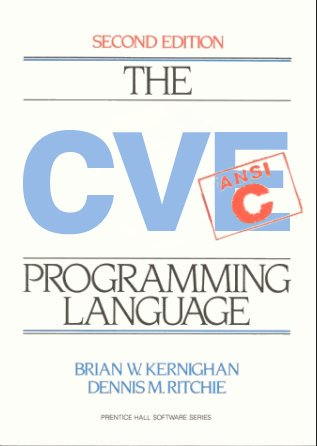

:title: Fuzzing with afl-fuzz
:author: Nils Moskopp
:css: index.css

afl-fuzz
========

- “smart” fuzzer
- coverage guided
- very low effort

----

fuzzing approaches
------------------

- blind fuzzing (loop)
- block coverage
- edge overage
- AFL model

----

AFL model (1)
-------------

- state exploration
- queue re-evaluation
- use coverage to cull

----

AFL model (2)
-------------

- trimming inputs → fast
- largely format-agnostic
- specialized dictionaries

----

AFL model (3)
-------------

- crash test deduplication
- address → is unreliable
- stack trace → inflation

----

AFL model (4)
-------------

- crash exploration!
- fork server (CoW)
- parallelization

----

AFL model (5)
-------------

- binary fuzz (qemu)
- cross-architecture
- file format analysis

----

pulling JPEGs out of thin air
-----------------------------

https://lcamtuf.blogspot.com/2014/11/pulling-jpegs-out-of-thin-air.html

----

a wild XML <!CDATA> appears!
----------------------------

https://lcamtuf.blogspot.com/2014/11/afl-fuzz-nobody-expects-cdata-sections.html

.. code::

   <a b="c">d</a>

.. code::

   <![<CDATA[C%Ada b="c":]]]>

----

risks of fuzzing
----------------

- CPU runs hot → throttling
- RAM and disk may fill up
- heavy I/O, i.e. SSD wear
- computer executes crap

----

prerequisites
-------------

1. a program that reads data
   eiter from stdin or file

2. the program must crash
   if important bugs occur

3. a small valid input file

----

quick start
-----------

compile with afc-gcc / afc-clang

.. code::

   afl-fuzz -i "${IDIR}" -o "${ODIR}" -- "${BIN}"

----

inputs
------

- gather valid inputs
- quantity > quality
- minimize corpus
- minimize files

----

TGA input (1)
-------------

- optional alpha channel
- bpp: 1, 8, 15, 16, 24, 32
- may be RLE-compressed
- may be color-mapped
- top-bottom / bottom-top

----

TGA input (2)
-------------

- 32bpp: B8G8R8A8
- 24bpp: B8G8R8
- 16bpp: A1R5G5B5
- 16bpp: K8A8
- 8bpp: K8

----

dictionaries
------------

→ just tokens, no grammar

.. code::

   tag_a="<a>"
   tag_abbr="<abbr>"
   tag_acronym="<acronym>"
   tag_address="<address>"

----

lots of CVEs
------------

https://github.com/mrash/afl-cve

(not updated since 2017)

----

programmming
------------

----

hands-on time
-------------

→ we start fuzzing now!

- scripts in folder
- ordered by numbers

----

interface
---------

- process timing
- overall results

----

interface: timing
-----------------

- should find paths in minutes!
- runtime: days, weeks, months?

----

interface: results
------------------

- cycles: count of queue passes
- color-coded (end: blue/green)
- paths: how much AFL knows yet
- AFL counts crashes & hangs ;)

----

interface: cycle progress
-------------------------

- how far along current pass is
- ID of test cases is important

----

interface: map coverage
-----------------------

- coverage (branch tuples)
- current input / corpus

----

interface: progress (1)
-----------------------

- calibration (briefly)
- trim testcases (length/step)
- bitflip (toggle/walk)
- arithmethics (add/sub ints)

----

interface: progress (2)
-----------------------

- interesting values (8 bit step)
- extras (dictionary injection)
- havoc (mutations + dictionary)
- splice (combines 2 queue items)
- sync (for parallel fuzzing)

----

interface: findings in depth
----------------------------

- nerd metrics

----

interface: strategy yields
--------------------------

- leaderboard ;)
- validate assumptions
- trim strategy (bytes/tries)

----

interface: path geometry (1)
----------------------------

- initial inputs: level 1
- derived inputs: level 2
- etc. pp.
- new paths found

----

interface: path geometry (2)
----------------------------

- stability: same execution?
- uninitialized memory used?
- leftover temporary files?
- sqlite “select random();”
- threads (harmless)

----

interface: CPU
--------------

- load is color-coded
- green: parallelize!
- red: no added fuzz!

----

status files
------------

- output directory
- fuzzer_stats file

----

sanitizers
----------

- ASAN
- MSAN
- UBSAN
- TSAN
- LSAN

----

sanitizers: ASAN (1)
--------------------------

*Address SANitizer*

- finds memory corruption:

  - buffer overflow
  - use after free
  - memory leaks

→ `-fsanitize=address`

----

sanitizers: ASAN (2)
--------------------------

- 32-bit: works ok
- 64-bit: memory hog

→ compile in 32 bit mode

- gcc compile option: -m32
- apt install gcc-multilib

----

sanitizers: MSAN
---------------------

*Memory SANitizer*

- finds uninitialized memory use

→ `-fsanitize=memory`

----

sanitizers: UBSAN
----------------------

*Undefined Behaviour SANitizer*

- finds undefined behavour

  - signed integer overflow
  - null pointer dereference
  - division by zero
  - etc. pp.

→ `-fsanitize=undefined`

----

sanitizers: TSAN
---------------------

*Thread SANitizer*

- finds race conditions

→ `-fsanitize=thread`

----

sanitizers: LSAN
---------------------

*Leak SANitizer*

- finds memory leaks
- little runtime overhead
- only triggers at the end

→ comes with address sanitizer

----

libfuzzer
---------

→ `-fsanitize=fuzzer`

https://www.moritz.systems/blog/an-introduction-to-llvm-libfuzzer/

https://google.github.io/clusterfuzz/setting-up-fuzzing/libfuzzer-and-afl/

----

sanitizers: common tips
-----------------------

- abort/trap on errors
- learn all the options
- use only one sanitizer
   - exception: libfuzzer

----

additional AFL
--------------

https://lcamtuf.coredump.cx/afl/

https://github.com/AFLplusplus/AFLplusplus

----

fun stuff
---------

more complex afl demo:
https://github.com/defuse/afl-demo

bug finding competition:
https://rode0day.mit.edu/
